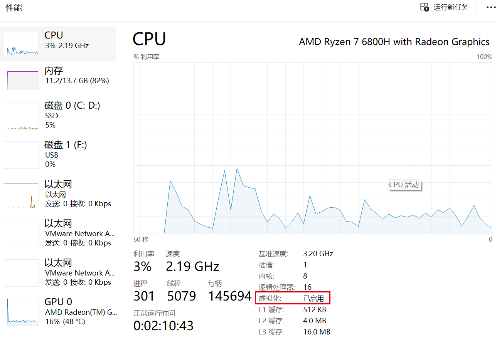
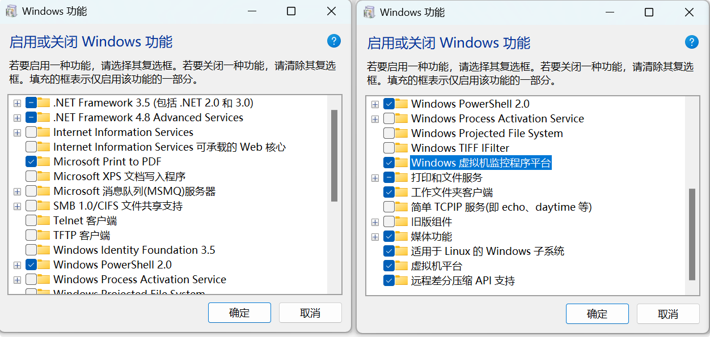
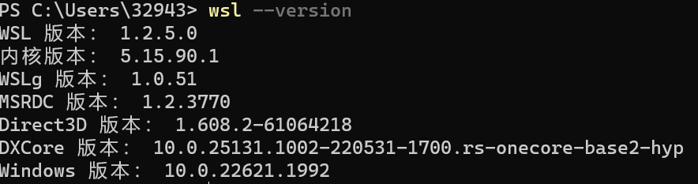
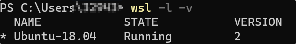

# 配置基础环境  

## 1.基于WSL2的环境配置  

### 1.1 WSL简介  

Windows Subsystem for Linux（简称WSL）是一个在Windows 10\11上能够运行原生Linux二进制可执行文件（ELF格式）的兼容层。它是由微软与Canonical公司合作开发，其目标是使纯正的Ubuntu、Debian等映像能下载和解压到用户的本地计算机，并且映像内的工具和实用工具能在此子系统上原生运行。如果使用Windows 10 2004以上，可以通过WSL 2来窗口化运行桌面应用，也不需要另外安装其他的X 服务器。  

### 1.2 win11下WSL启用  

#### 确认电脑开启虚拟化功能  

打开任务管理器，点击cpu，虚拟化开启成功后的任务管理器如图所示。
  

#### 系统设置:开启windows功能  

搜索框搜索“控制面板”，按照“控制面板->程序->启用或关闭 windows 功能”，选择开启 Windows 虚拟化和 Linux 子系统（WSL2）以及Hyper-V，如下图所示。  
  

#### 打开Power Shell  

1、以管理员命令输入下方代码：  

```bash

bcdedit /set hypervisorlaunchtype auto

```  

2、Powershell内输入：

```bash

wsl --set-default-version 2

```  

显示如下代表wsl2启用成功  

  

3、查看wsl版本  

  

### 1.3 基于WSL的Ubuntu18.04安装  

* 打开Microsoft Store  
* 搜索“Ubuntu”
* 选择“Ubuntu 18.04.6 LTS”，点击获取  
* 等待安装成功  
* 设置用户名和密码  
  请注意，在设置密码时，密码不会显示出来，直接输入就好
* 完成

### 1.4 导出安装文件至其他目录  

wsl安装的虚拟环境默认安装在c盘之中，这对于c盘拥挤型选手十分不友好，因此需要将安装完成的虚拟环境迁移至其他盘中。  

#### I.查看wsl状态并关闭  

打开powershell，输入`wsl -l -v`查看虚拟机状态，如果STATE显示为Running，则须在powershell中使用`wsl --shutdown`关闭虚拟机  

  

#### II.导出镜像  

在powershell中输入`wsl --export Ubuntu-18.04 D:\AppData\WSL\ubuntu1804\ubuntu18.04.tar` ,`D:\AppData\WSL\ubuntu1804\ubuntu18.04.tar`是导出路径。  

#### III.注销c盘虚拟机  

在powershell中输入`wsl --unregister Ubuntu-18.04`，再输入`wsl -l -v`,可以发现子系统已经删除  

#### IV.导入镜像  

在powershell中输入`wsl --import Ubuntu-18.04 D:\AppData\WSL\ubuntu1804 D:\AppData\WSL\ubuntu1804\ubuntu18.04.tar`，其中`D:\AppData\WSL\ubuntu1804`是子系统安装路径，`D:\AppData\WSL\ubuntu1804\ubuntu18.04.tar`是步骤II中子系统镜像导出路径。  

#### V.完成  
